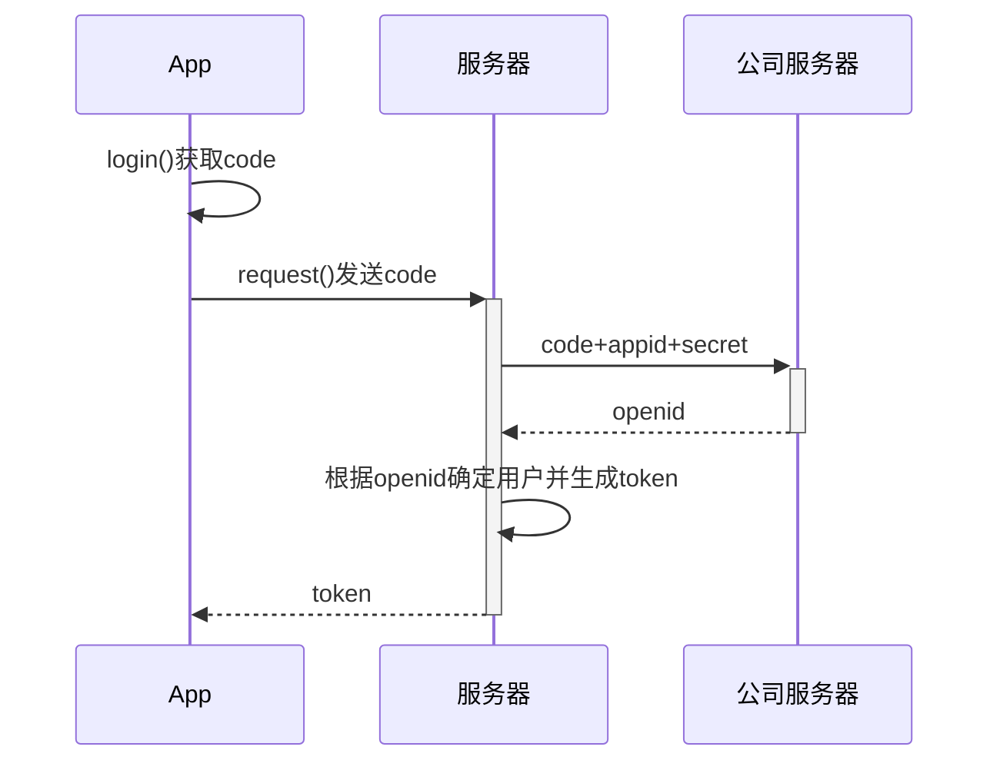
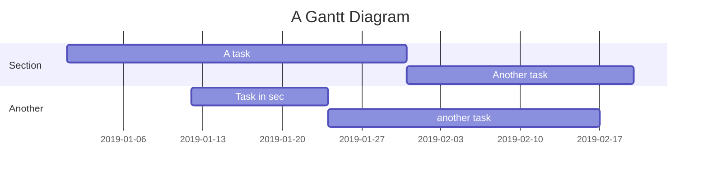
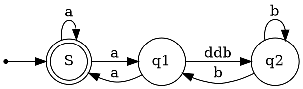

# 欢迎使用 `Ikiler` 在线 Markdown 编辑器

[makedown数学公式语法](https://blog.csdn.net/zdk930519/article/details/54137476?utm_medium=distribute.pc_aggpage_search_result.none-task-blog-2~aggregatepage~first_rank_ecpm_v1~rank_v31_ecpm-2-54137476.pc_agg_new_rank&utm_term=markdown%E6%80%8E%E4%B9%88%E5%BC%80%E6%A0%B9%E5%8F%B7&spm=1000.2123.3001.4430)

Ik-markdown，是一款基于 `Vditor`而构建的 Markdown 编辑器；轻量且强大，在使用之前，希望您能**阅读此文档**了解本插件一些功能

- 支持三种编辑模式：

  - 🦍 所见即所得
  - 🦧 即时渲染（默认模式，类似Typroa）
  - 🦺 分屏预览（源码模式）

> 支持快捷键切换 ctrl + alt + 7，8，9可快速切换不同模式，更多快捷键请留意说明

* 🛍支持大纲、**数学公式**、**脑图**、**图表**、**流程图**、**甘特图**、**时序图**、五线谱、代码高亮及复制、**graphviz 渲染**、**[plantuml]UML 图**

- 👛支持TODO列表

- [X]  🎓 支持粘贴 HTML 自动转换为 Markdown；
- [X]  🔈 支持插入原生 Emoji表情；
- [X]  📯 支持编辑内容实时保存**本地存储**
- [X]  📝 支持**实时预览**，字符计数；

> 更多功能仍在完善，敬请期待

---

## 如何使用

### 支持基础markdown语法解析

> 我是引用文本

- **加粗** - `**加粗**` | *倾斜* - `*倾斜*` | ~~删除线~~ - `~~删除线~~` |  `Code 标记` - `` `Code 标记` ``
- [超级链接](https://ld246.com) - `[超级链接](https://ld246.com)`
- [username@gmail.com](mailto:username@gmail.com) - `[username@gmail.com](mailto:username@gmail.com)`

基础语法在这里不做过多说明，更多详情请访问[https://markdown.com.cn/](https://markdown.com.cn/)获取更多资源

---

### 数学公式

$$
a^2 + b^2 = \color{red}c^2

$$

> 行内公式

这是一段内容的行内公式$a^2 + b^2 = \color{red}c^2$

---

### 高亮代码

```java
class Test{
	public static void main(String[] args) {
		System.out.println("hello Ikiler-markdown");
	}
}
```

---

### 隐藏细节

<details>
<summary>这里是摘要部分。点击展示更多细节</summary>
这里是细节部分。
</details>

---

### 绘制流程图


---

### 绘制脑图

```mindmap
- 教程
- 语法指导
  - 表情符号 Emoji
    - 一些表情例子
  - 大标题 - Heading 3
    - Heading 4
      - Heading 5
  - 图片
  - 代码块
    - 普通
    - 语法高亮支持
      - 演示 Java 高亮
  - 表格
  - 隐藏细节
  - 段落
  - 链接引用
  
- 快捷键
```

---

### 绘制时序图



---

### 绘制甘特图



### 支持图表

#### 饼图

```echarts
{
  "backgroundColor": "#e3dbbf",
  "title": {
    "text": "程序员上班干什么",
    "subtext": "2019 年 6 月份",
    "x": "center",
    "textStyle": {
      "color": "#251c12"
    }
  },
  "tooltip": {
    "trigger": "item",
    "formatter": "{a} <br/>{b} : {c} ({d}%)"
  },
  "legend": {
    "orient": "vertical",
    "left": "left",
    "data": [
      "玩手机",
      "摸鱼",
      "吹牛逼",
      "写代码",
      "睡觉"
    ],
    "textStyle": {
      "color": "#f2f2f2"
    }
  },
  "series": [
    {
      "name": "程序员上班干什么",
      "type": "pie",
      "radius": "55%",
      "center": [
        "50%",
        "60%"
      ],
      "data": [
        {
          "value": 440,
          "name": "玩手机",
          "itemStyle": {
            "color": "#ef4136"
          }
        },
        {
          "value": 770,
          "name": "摸鱼"
        },
        {
          "value": 430,
          "name": "吹牛逼"
        },
        {
          "value": 42,
          "name": "写代码"
        },
        {
          "value": 18,
          "name": "睡觉"
        }
      ],
      "itemStyle": {
        "emphasis": {
          "shadowBlur": 10,
          "shadowOffsetX": 0,
          "shadowColor": "rgba(0, 0, 0, 0.5)"
        }
      }
    }
  ]
}
```

#### 曲线图

```echarts
{
  "title": { "text": "最近 30 天" },
  "tooltip": { "trigger": "axis", "axisPointer": { "lineStyle": { "width": 0 } } },
  "legend": { "data": ["帖子", "用户", "回帖"] },
  "xAxis": [{
      "type": "category",
      "boundaryGap": false,
      "data": ["2019-05-08","2019-05-09","2019-05-10","2019-05-11","2019-05-12","2019-05-13","2019-05-14","2019-05-15","2019-05-16","2019-05-17","2019-05-18","2019-05-19","2019-05-20","2019-05-21","2019-05-22","2019-05-23","2019-05-24","2019-05-25","2019-05-26","2019-05-27","2019-05-28","2019-05-29","2019-05-30","2019-05-31","2019-06-01","2019-06-02","2019-06-03","2019-06-04","2019-06-05","2019-06-06","2019-06-07"],
      "axisTick": { "show": false },
      "axisLine": { "show": false }
  }],
  "yAxis": [{ "type": "value", "axisTick": { "show": false }, "axisLine": { "show": false }, "splitLine": { "lineStyle": { "color": "rgba(0, 0, 0, .38)", "type": "dashed" } } }],
  "series": [
    {
      "name": "帖子", "type": "line", "smooth": true, "itemStyle": { "color": "#d23f31" }, "areaStyle": { "normal": {} }, "z": 3,
      "data": ["18","14","22","9","7","18","10","12","13","16","6","9","15","15","12","15","8","14","9","10","29","22","14","22","9","10","15","9","9","15","0"]
    },
    {
      "name": "用户", "type": "line", "smooth": true, "itemStyle": { "color": "#f1e05a" }, "areaStyle": { "normal": {} }, "z": 2,
      "data": ["31","33","30","23","16","29","23","37","41","29","16","13","39","23","38","136","89","35","22","50","57","47","36","59","14","23","46","44","51","43","0"]
    },
    {
      "name": "回帖", "type": "line", "smooth": true, "itemStyle": { "color": "#4285f4" }, "areaStyle": { "normal": {} }, "z": 1,
      "data": ["35","42","73","15","43","58","55","35","46","87","36","15","44","76","130","73","50","20","21","54","48","73","60","89","26","27","70","63","55","37","0"]
    }
  ]
}
```

### 绘制表格


| 搜索引擎 | 地址                                            | 访问速度 |
| :--------- | :------------------------------------------------ | :--------: |
| 百度     | [https://www.baidu.com](https://www.baidu.com)  |    快    |
| 谷歌     | [https://www.google.com](https://www.baidu.com) |   哦吼   |
| 360      | [https://www.so.com/](https://www.so.com/)      |    快    |

### 五线谱

```abc
X: 24
T: Clouds Thicken
C: Paul Rosen
S: Copyright 2005, Paul Rosen
M: 6/8
L: 1/8
Q: 3/8=116
R: Creepy Jig
K: Em
|:"Em"EEE E2G|"C7"_B2A G2F|"Em"EEE E2G|\
"C7"_B2A "B7"=B3|"Em"EEE E2G|
"C7"_B2A G2F|"Em"GFE "D (Bm7)"F2D|\
1"Em"E3-E3:|2"Em"E3-E2B|:"Em"e2e gfe|
"G"g2ab3|"Em"gfeg2e|"D"fedB2A|"Em"e2e gfe|\
"G"g2ab3|"Em"gfe"D"f2d|"Em"e3-e3:|
```

### Graphviz



### Flowchart

```flowchart
st=>start: Start
op=>operation: Your Operation
cond=>condition: Yes or No?
e=>end

st->op->cond
cond(yes)->e
cond(no)->op
```
